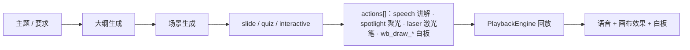
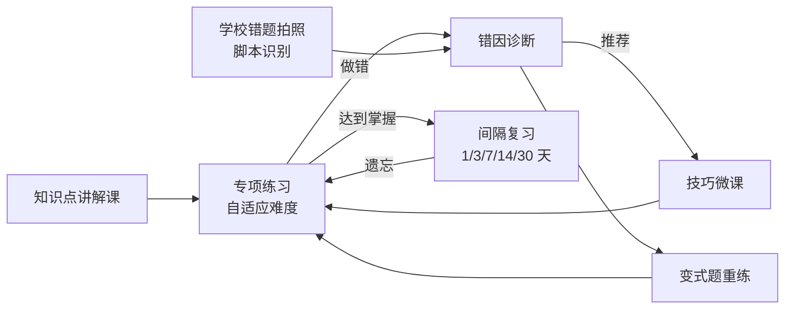
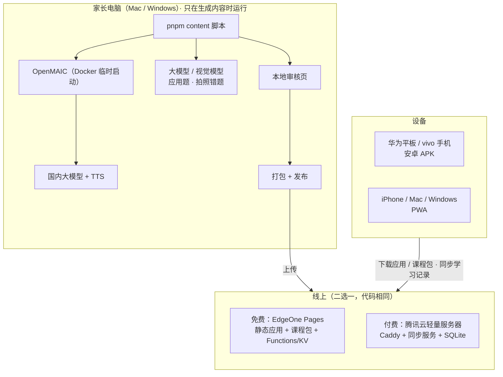

# 家庭小学数学 AI 学习 App：分析与技术方案

> 版本：v0.3　日期：2026-09-24（历史版本见 git 记录：v0.1 面向公开运营，v0.2 首次按家庭自用改写）
> 参考项目：[THU-MAIC/OpenMAIC](https://github.com/THU-MAIC/OpenMAIC)（MIT 协议，分析基于 v1.1.0 / main 分支）
> 使用场景：家庭自用，给自家孩子补习和巩固
> 教材：**深圳北师大版数学**；MVP 做**二年级和四年级**，当前学期先做上册
> 设备：华为平板（HarmonyOS 4.x）、vivo 安卓手机、家长的 iPhone 和 Mac，以及 Windows（加分项）

---

## 0. 结论

1. **核心是专项练习，讲解课为练习服务。** 闭环是：知识点讲解 → 技巧微课 → 专项练习（自适应难度）→ 错因诊断 → 针对性重练 → 间隔复习。
2. **所有 AI 内容都用脚本提前生成，App 运行时不调用任何大模型接口。** 家长在自己电脑上运行 `pnpm content …` 脚本：脚本调用本地临时启动的 OpenMAIC，批量生成讲解课和技巧课（含语音），也生成应用题。生成后在本地预览审核，通过的内容打包发布。孩子学习时播放的都是静态文件。
3. **计算类练习由程序现场出题**：在设备本地运行，答案 100% 正确，题量不限，不需要大模型。
4. **一套 Web 代码，覆盖所有设备**：
   - 华为平板和 vivo 手机装**同一个安卓 APK**（HarmonyOS 4.x 能直接安装 APK）；
   - iPhone、Mac、Windows 用 **PWA**（浏览器"添加到主屏幕 / 安装应用"）；
   - 需要时再给 Mac 和 Windows 打包桌面安装包。
5. **两种部署方式，代码相同，可以随时切换**：
   - **免费方案**：腾讯云 EdgeOne Pages，托管应用和课程包，用它的 Functions + KV 存学习记录；
   - **腾讯云服务器方案**：轻量应用服务器，一条 Docker Compose 命令部署。
   两种都支持在外面访问。
6. **先交付练习，再做讲解课**：大约 3 周能让孩子用上专项练习，再用 2 周接入脚本生成的讲解课。

---

## 1. OpenMAIC 分析

### 1.1 项目概况

OpenMAIC（Open Multi-Agent Interactive Classroom）是清华 MAIC 团队开源的 AI 互动课堂平台。输入主题，它会自动生成一堂课：幻灯片、测验、HTML 交互实验，由 AI 老师语音讲解，配合聚光灯、激光笔和白板推导。

| 维度 | 情况 |
| --- | --- |
| 协议 | MIT（v0.3.0 起由 AGPL-3.0 改为 MIT），可以自由使用和修改，保留版权声明即可 |
| 技术栈 | Next.js 16 + React 19 + TypeScript + Tailwind CSS 4 + LangGraph |
| 模型支持 | 内置 DeepSeek、通义千问、豆包、智谱 GLM、腾讯混元、Kimi、MiniMax 等国内模型 |
| 规模 | 应用层约 23.7 万行 TS/TSX，另有 6 个 `@openmaic/*` npm 包 |
| 形态 | 纯 Web，官方提供 Docker 部署 |

### 1.2 核心机制

一堂课是 **Stage（课）+ Scene[]（页）+ 每页的 Action[]（讲解动作序列）**，全部是结构化 JSON：



它的服务端生成接口可以开启 TTS，把讲解语音一起生成并保存。所以**"提前生成 → 打包 → 离线回放"完全可行**，回放时不需要模型。

### 1.3 本项目怎么用 OpenMAIC（不 Fork）

| OpenMAIC 能力 | 用法 |
| --- | --- |
| Docker 镜像 | 家长运行生成脚本时在本地临时启动，锁定版本，**不部署到线上** |
| `POST /api/generate-classroom`（`requirement`、`language: zh-CN`、`enableTTS: true`） | 生成脚本逐课时调用，然后轮询任务 |
| `GET /api/classroom?id=`、`/api/classroom-media/<id>/…` | 取回 Stage、Scenes JSON 和语音、图片，转换成课程包 |
| `@openmaic/dsl`、`@openmaic/renderer`（npm） | App 依赖：课件类型定义、幻灯片渲染 |
| 回放引擎 `lib/playback` + `lib/action`（约 1.6k 行） | 移植到 `packages/player`，去掉和 zustand 的耦合 |
| OpenMAIC 自带的编辑界面 | 家长可以在里面手动修改某节课，再让脚本重新导出 |

### 1.4 需要自己做的部分

- 练习系统（最大的部分）：出题器、竖式输入、自适应、错因诊断、错题本、复习调度
- 北师大版知识点树
- 批量生成、审核、打包、发布脚本
- 孩子档案、学习记录同步、家长报告
- 适合孩子的界面，以及多设备打包

---

## 2. 使用场景与约束

- **家庭自用**：不上架应用商店，不需要教育 App 备案。
- **运行时不调用模型**：AI 内容全部由家长用脚本提前生成、审核后才发布。这也符合教育部《中小学生成式人工智能使用指南（2025 年版）》对小学生使用 AI 的建议。
- **设备与使用者**：

| 设备 | 主要使用者 | 安装方式 |
| --- | --- | --- |
| 华为平板（HarmonyOS 4.x） | 孩子（主力学习设备） | 安卓 APK（需要关闭"纯净模式"或允许安装外部来源应用） |
| vivo 手机 | 孩子 | 同一个 APK |
| iPhone | 家长（查看报告，也可以用来学习） | PWA：Safari → 分享 → 添加到主屏幕 |
| Mac | 家长（查看、审核；**运行生成脚本**） | PWA；也可以用 Tauri 打包 .app |
| Windows（可选） | 任何人 | PWA（Edge/Chrome 安装应用）；也可以用 Tauri 打包 .exe |

  孩子的两台设备都用 APK 而不是 PWA，原因有两个：国产安卓浏览器对 PWA 安装的支持不稳定；APK 把应用本体内置在包里，离线最可靠。

- **教材版本**：二年级在 2026 年秋季使用的应该是按 2022 版课标修订的北师大版新教材；四年级应该仍是现行旧版。**M0 生成知识点树前会对照最新公开目录核对**，你有空时也可以对照孩子的课本目录确认一下。
- **学期**：上册在 1 月期末前用起来；下册在寒假前准备好。

---

## 3. 学习闭环



每个**知识点**挂着这些内容：

| 内容 | 形式 | 来源 |
| --- | --- | --- |
| 讲解课（8–12 分钟） | 幻灯片 + AI 老师语音 + 白板推导 + 例题 | 脚本调用 OpenMAIC 预生成，家长审核 |
| 技巧微课（3–5 分钟） | 同上，只讲一个方法 | 同上，关联到错因 |
| 专项练习 | 程序出题器 + 预生成并审核过的应用题库 | `packages/practice` + 脚本 |
| 错因标签 | 例如"忘记进位""试商偏大没调" | 诊断规则 |
| 前置知识点 | 例如"三位数乘两位数"依赖"乘法口诀" | 知识点树 |

技巧微课举例：
- 二年级：进位加法凑十、退位减法破十、乘法口诀记忆规律、画图理解乘除法、应用题找数量关系
- 四年级：四舍五入试商、调商方法、凑整简便计算（25×4、125×8）、乘法分配律正用/逆用、大数改写与求近似数的区别、量角三步法、画线段图

---

## 4. 专项练习系统设计（核心）

### 4.1 题目来源

| 来源 | 适用 | 正确性保障 | 何时产生 | 阶段 |
| --- | --- | --- | --- | --- |
| **程序出题器** | 口算、竖式、口诀、单位换算、大数读写、简便计算、量角等 | 答案由代码计算；可复现（出题器 + 参数 + 随机种子） | 设备本地实时出题（不涉及 AI） | M0–M1 |
| **脚本预生成应用题** | 解决问题类题目 | 模型输出题干 + 结构化算式，程序验算答案，家长审核后才入库 | 家长运行脚本 | M3 |
| **拍照错题（脚本）** | 学校作业、试卷上的错题 | 视觉模型识别 → 标注知识点和错因 → 生成变式题；家长在审核页确认 | 家长把照片放进文件夹，运行脚本 | M3 |
| **家长手动录入** | 任何题 | 家长把关 | 家长模式 | M1 |

### 4.2 上册出题器清单（M0 按最新目录校准）

| 年级 | 领域 | 题型 | 可控难度 | 典型错因（用于诊断） |
| --- | --- | --- | --- | --- |
| 二上 | 100 以内加减法 | 口算、竖式、连加连减、加减混合、带括号 | 是否进位/退位、项数、有无括号 | 忘记进位；退位后没减 1；数位没对齐 |
| 二上 | 表内乘法 | 口诀填空、看算式写积、看积找算式、限时挑战 | 口诀范围（2–5 / 6–9）、是否限时 | 相邻口诀混淆（如 6×8 和 7×8） |
| 二上 | 表内除法 | 平均分、用口诀求商 | 除数范围 | 想错口诀 |
| 二上 | 单位 | 人民币换算、长度单位选择与换算 | 单位组合 | 进率记错 |
| 四上 | 大数 | 读数写数、改写成"万/亿"作单位、四舍五入求近似数、比大小 | 位数、中间和末尾 0 的个数 | 中间的 0 读错；改写和求近似数混淆 |
| 四上 | 乘法 | 三位数×两位数竖式、因数末尾有 0、估算 | 进位次数、0 的位置 | 部分积没错位；漏加进位；末尾 0 处理错 |
| 四上 | 除法 | 除数是两位数的除法（试商、调商）、商的变化规律 | 四舍/五入试商、是否需要调商、商中间或末尾有 0 | 试商偏大或偏小没调；余数 ≥ 除数；商写错位置 |
| 四上 | 运算律 | 简便计算、判断能否简便 | 凑整组合、分配律正用/逆用 | 分配律漏乘一项 |
| 四上 | 线与角 | 量角（交互量角器）、角的分类、用平角/周角求未知角 | 角度范围、开口方向 | 内圈外圈读反 |
| 四上 | 负数 | 读写负数、在数轴上表示、生活情境中比大小 | 数的范围 | 负数比大小方向弄反 |

### 4.3 练习模式

| 模式 | 说明 |
| --- | --- |
| 知识点专项 | 选一个知识点做 10–20 题，难度自适应 |
| 口算速练 | 限时挑战（如乘法口诀 1 分钟），记录速度曲线 |
| 竖式专练 | 逐格填写竖式（含进位、部分积、余数），可开"逐步提示" |
| 错题重练 | 原题 + 同类变式题 |
| 到期复习 | 每个知识点 3–5 题小测 |
| 单元小测 | 单元内混合出题，不给提示 |
| 纸质练习 | 生成 A4 PDF（竖式留足空间）+ 答案页 |

### 4.4 作答交互

- **大号数字键盘**：不弹系统键盘，按键大，平板和手机都好按。
- **竖式格子**：按数位对齐，从右往左填，有进位小格，能定位到"哪一格错了"。
- **口诀挑战**：卡片翻转加连击。
- 选择、判断、比大小（点 `>` `<` `=`）、排序、数轴拖点。
- **交互量角器**（SVG）：可以拖动、旋转。
- 答错先给提示，再给解析。解析由程序生成、逐步演示（例如竖式一步步动画），不需要 AI。

### 4.5 掌握度、自适应与复习

- **能力值**：每个知识点有能力值 θ，每道题有难度 d（1–5），作答后按 Elo 方式更新 θ。口算类把用时计入，超时算"半对"。
- **选题**：选择预测正确率约 80% 的难度，让孩子"跳一跳够得着"。
- **掌握判定**：θ 达到目标难度，且最近 10 题正确率 ≥ 90%。口算类还要求速度达标，例如乘法口诀平均每题 ≤ 3 秒（阈值家长可调）。
- **间隔复习**：掌握后按 1、3、7、14、30 天安排复习；复习做错就退回"练习中"，间隔重置。
- **前置补救**：某个知识点反复卡住、而前置知识点掌握度低时，提示先练前置知识点。

### 4.6 错因诊断

把孩子的答案和一组"典型错误算法"的结果对比，例如"进位全部漏加""部分积没有错位""退位后没减 1""试商偏大没调"。命中就标注错因，然后：
1. 推荐对应的技巧微课；
2. 出一组针对这个错因的专项题；
3. 计入家长报告的"错因排行"。

### 4.7 错题本与今日任务

- **错题本**：做错自动收录。原题重做正确，并且在不同的日子做对 2 道同类变式题，才算清除。可以打印成纸质错题卷。
- **今日任务**：默认 15–20 分钟（家长可调），顺序是口算热身 → 到期复习 → 错题重练 → 当前知识点专项 →（可选）一节讲解课或技巧课。完成后得星星、记连续打卡天数，只和自己的过去比。

### 4.8 家长模式（PIN 码进入）

- 每个孩子的知识点掌握地图、错因排行、正确率和用时趋势、每日时长
- 布置专项：选知识点、题量、截止日期
- 手动录题
- 设置：每日时长上限、护眼提醒、掌握阈值

AI 内容的审核不在 App 里做，在生成脚本自带的**本地审核页**里完成，见 5.2。

---

## 5. 技术方案

### 5.1 总体架构



**关键点**：线上只有静态文件和一个很小的"学习记录同步"接口，没有任何模型调用。大模型 API Key 只存在家长电脑的 `.env` 里。

### 5.2 内容生成脚本（`tools/content`）

```bash
pnpm content openmaic up                     # 用 Docker 启动锁定版本的 OpenMAIC（本地）
pnpm content gen --book bsd-g4a --unit 3     # 按知识点批量生成讲解课 / 技巧课（含语音）
pnpm content problems --book bsd-g2a         # 生成应用题，程序验算后进入待审核
pnpm content photos ./photos --child c1      # 拍照错题：识别 → 知识点 / 错因 → 变式题（待审核）
pnpm content review                          # 打开本地审核页：逐课播放、逐题检查，通过 / 打回 / 备注后重生成
pnpm content build                           # 审核通过的内容 → 课程包 / 题库（校验、音频压缩、哈希、清单）
pnpm content publish --target edgeone        # 发布到免费方案（或 --target tencent）
pnpm content openmaic down                   # 用完关掉
```

设计要点：
- **断点续跑**：每个课时的状态（待生成 / 已生成 / 待审核 / 通过 / 打回）记在 `content/state.json`，中途失败可以接着跑，已通过的不会重复生成。
- **并发和重试可控**：避免触发模型接口限流；每节课都记录用了多少 token 和费用。
- **生成要求模板**化（知识点、年级、教材版本、时长、深圳本地情境、每页字数上限），模板可以单独改，改完只重新生成受影响的课。
- **课程 JSON 放进 git**（体积小，方便看改动）；语音和图片放在 `content/out/`，不进 git，直接发布到线上。
- 生成机器：家长的 Mac 或 Windows（需要 Docker Desktop 或 OrbStack）。也可以选 GitHub Actions：在 CI 里启动 OpenMAIC、生成并发布，API Key 放在仓库 Secrets 里；私有仓库每月有免费运行分钟数。

讲解课生成要求模板（示意）：

```
为深圳北师大版数学{年级}{册}「{单元}」中的知识点「{知识点}」生成一节 {8–12} 分钟的讲解课。
对象：{年级}小学生（约 {年龄} 岁）。语言口语化、句子短，术语与北师大版课本一致。
结构：生活情境导入（优先用深圳本地场景，如地铁、深圳湾公园、菜市场）→ 讲清概念和方法
→ 2 道例题在白板上逐步推导 → 3 道课堂小题 → 一句话小结。
每页文字不超过 40 字；不超出本册教学范围；不引入课本没有的解法名称。
```

### 5.3 部署：两种方式

两种方式共用同一套代码。同步接口用 **Hono** 编写（同时支持 Node 和边缘函数运行时），存储层抽象成接口，分别实现 SQLite 版和 KV 版。

| 项 | A. 免费：EdgeOne Pages | B. 腾讯云轻量应用服务器 |
| --- | --- | --- |
| 应用和课程包 | Pages 静态托管，国内有节点 | Caddy 静态托管（或放到 COS + CDN） |
| 学习记录同步 | Pages Functions + KV | Hono（Node）+ SQLite |
| 费用 | 0 元（域名可选，约几十元/年） | 香港 2 核 2G 约 384 元/年（2026 年优惠价，以官网为准）；新用户活动价更低 |
| 域名和备案 | 默认送 `*.edgeone.app` 域名；绑定自己的域名时，国内加速要求域名已备案，国际站不要求备案 | **香港地域免备案**，大陆访问延迟约 30–50ms；广州地域更快，但域名需要 ICP 备案（个人可办，约 1–3 周） |
| 外网访问 | ✅ | ✅（HTTPS 由 Caddy 自动申请证书） |
| 限制 | 所有项目总大小不超过 5GB（估计每节课 5–10MB，两个年级一学期不到 1GB，够用）；免费额度规则可能调整 | 需要自己运维（Docker Compose 一条命令部署，每天自动备份 SQLite） |
| 适合 | 先零成本用起来 | 想要更稳、可控、以后扩展功能 |

**建议**：先用 A 零成本上线；如果遇到访问速度或额度问题，再迁到 B（同一个发布脚本，换一个 `--target` 参数）。

安全：
- 整个站点用"家庭口令"登录，登录后发令牌，同步接口按家庭隔离；
- 家长模式另设 PIN；
- 线上不存储任何 API Key。

备选：Cloudflare Pages 也免费，但 `*.pages.dev` 在国内经常无法访问，必须绑自己的域名，速度也不稳定，所以不作为首选。

### 5.4 客户端（`apps/web` + 打包壳）

- **技术**：Vite + React 19 + TypeScript + Tailwind CSS 4，和 OpenMAIC 同栈，直接用 `@openmaic/renderer`。
- **页面**：选孩子 → 首页（今日任务、继续学习）→ 知识地图 → 讲解/技巧课播放 → 专项练习 → 错题本 → 家长模式。
- **离线优先**：
  - 应用本体：APK 内置；PWA 由 Service Worker 缓存。
  - 练习记录、错题、课程包语音存在 IndexedDB。
  - 出题器在本地运行，断网也能练；课程包可以按单元预下载。
- **同步**：作答记录是只追加的事件日志（每条带 UUID），联网后上传和拉取，不会冲突。掌握度由事件日志确定性地重新计算，所以每台设备结果一致。
- **打包**（`shells/tauri`，Tauri 2）：
  - 安卓 APK：GitHub Actions 自动构建，**华为平板和 vivo 手机共用**；应用内检查新版本并提示下载。
  - Mac `.app`、Windows `.exe`：可选。自用不需要公证或代码签名，但首次打开要在系统里允许运行。
  - iPhone 只用 PWA，不打包 iOS App（打包需要付费开发者账号，不值得）。
- **播放细节**：语音按 Blob 从 IndexedDB 取出播放，保证 iOS PWA 和安卓 WebView 下都能连续播放；第一次播放需要用户点一下（浏览器的自动播放限制）。
- **适配**：手机竖屏时课件在上、作答区在下；平板、Mac、Windows 横屏时左右分栏。竖式格子在平板上体验最好。

### 5.5 数据模型

| 数据 | 位置 | 说明 |
| --- | --- | --- |
| 知识点树 | 静态 JSON（`packages/curriculum`） | 北师大版 二上/二下/四上/四下；前置关系、目标难度 |
| 课程包 | 静态文件 | 讲解课、技巧课 |
| 应用题库、变式题 | 静态 JSON | 预生成并审核通过的题目 |
| 孩子档案、家长设置 | 同步接口 | 小数据 |
| 作答事件日志 | 设备 IndexedDB + 同步接口 | 孩子、题目（或出题器 + 参数 + 种子）、答案、对错、用时、错因、设备 |
| 掌握度、复习计划、错题本 | 由事件日志计算 | 不需要单独同步 |

课程包结构：

```
bsd.g4a.u3.mul-3x2.lesson@v2/
├── manifest.json        # 知识点、时长、版本、审核时间、各文件哈希
├── stage.json           # @openmaic/dsl Stage
├── scenes/*.json        # Scene（slide / interactive）+ actions[]
├── audio/*.mp3          # 预合成讲解语音
└── images/*
```

### 5.6 仓库结构（pnpm monorepo）

```
xuexi/
├── apps/
│   ├── web/             # 孩子端 + 家长模式（React PWA）
│   └── sync/            # 同步接口（Hono）：Node 版 + EdgeOne Functions 版
├── packages/
│   ├── practice/        # 出题器、判分、分步解析、错因诊断、掌握度与复习调度（纯 TS，单测全覆盖）
│   ├── curriculum/      # 北师大版知识点树
│   ├── player/          # 讲解课播放引擎（移植自 OpenMAIC，保留 MIT 声明）
│   └── shared/          # 共享类型
├── tools/
│   └── content/         # 内容生成、审核、打包、发布脚本
├── shells/
│   └── tauri/           # 安卓 APK / Mac / Windows 打包
├── deploy/
│   ├── edgeone/         # 免费方案配置
│   └── tencent/         # docker-compose.yml（Caddy + sync）+ 备份脚本
├── content/             # 课程 JSON（进 git）；out/（语音和图片，不进 git）
└── docs/
```

### 5.7 模型与语音（只在生成脚本里使用）

| 用途 | 建议 |
| --- | --- |
| 讲解课生成 | DeepSeek / 通义千问 / 智谱 GLM（OpenMAIC 已内置适配） |
| 应用题出题 | 同上，结构化输出，程序验算 |
| 拍照识别错题 | 通义千问 VL / 豆包视觉 / GLM 视觉模型 |
| 讲解语音 | OpenMAIC 已支持的国内 TTS（如 MiniMax），选一个亲切的"老师"音色 |

费用：只在生成时产生，运行时为 0。按国内主流模型价格估计，单节课（含语音）约几毛到几块钱，一个学期两个年级约 100 节课，总费用预计在几百元以内。M2 实测后会校准。

---

## 6. 里程碑

| 阶段 | 预计 | 交付 | 孩子能用上什么 |
| --- | --- | --- | --- |
| **M0 骨架 + 第一批练习** | 约 1 周 | monorepo；PWA 骨架；6 个核心出题器（二上：进位/退位加减、乘法口诀；四上：三位数乘两位数、除数是两位数的除法、大数读写、简便计算）及单测；大键盘和竖式格子；本地记录；部署到 EdgeOne Pages；APK 自动构建；在华为平板、vivo、iPhone、Mac 上真机验证；二上、四上知识点树 | 口算、竖式、口诀练习 |
| **M1 专项练习闭环** | 约 2 周 | 上册全部出题器；掌握度 + 自适应 + 间隔复习；错因诊断；错题本；今日任务；两个孩子的档案；家长模式和报告；家庭口令登录和多设备同步（KV 版 + SQLite 版）；腾讯云 Docker Compose 部署；手动录题；打印 PDF | 完整的每日专项练习 |
| **M2 讲解课与技巧课** | 约 2 周 | `tools/content`：启动 OpenMAIC、批量生成、断点续跑、本地审核页、打包、发布；移植播放器；课程包离线缓存；技巧课和错因关联；先生成二上、四上的第一个单元，实测质量和费用 | 知识点讲解和技巧微课 |
| **M3 应用题与拍照错题** | 约 2 周 | 应用题脚本（生成 + 验算 + 审核）；拍照错题脚本（识别 → 知识点和错因 → 变式题 → 审核 → 发布到该孩子的题单）；上册内容全部生成完 | 应用题专项、学校错题变式练习 |
| **M4 下册与完善** | 寒假前 | 二下、四下知识点树、出题器和内容；Mac 和 Windows 桌面包（按需）；根据使用反馈优化 | 下学期内容 |

建议每个阶段结束后先让孩子试用一周，再根据反馈调整下一阶段。

---

## 7. 风险与对策

| 风险 | 对策 |
| --- | --- |
| AI 讲解或题目出错 | 计算题全部由程序出题；应用题程序验算 + 家长审核；讲解课审核通过才发布 |
| 免费托管访问速度或额度变化 | 发布脚本支持两种部署目标，可以一键迁到腾讯云服务器；学习记录可以导出 |
| 华为平板安装 APK 受限 | 关闭"纯净模式"或允许外部来源；实在不行就用华为浏览器打开 PWA 地址 |
| 离线时的数据 | 离线优先，练习和已下载的课程离线可用，联网后补同步 |
| OpenMAIC 版本变化 | 只在本地通过 HTTP 接口使用，锁定镜像版本；播放器移植一次后自己维护 |
| 孩子使用时间过长 | 家长设置每日时长上限和护眼提醒 |
| 数据和密钥安全 | 线上不存 API Key；全站家庭口令登录 + HTTPS；家长模式另设 PIN |

---

## 8. 待确认事项（不影响 M0 开工）

1. 是否已有**域名**，或者愿意买一个（约几十元/年）？免费方案可以先用 EdgeOne 送的默认域名，M0 实测它在国内的访问情况。
2. **大模型和 TTS 的 API Key** 用哪家？M2 才需要。
3. 你的 Mac 能否安装 **Docker Desktop 或 OrbStack**，用来运行生成脚本？还是希望生成放在 GitHub Actions 上跑？
4. 是两个孩子分别读二年级和四年级吗？需要他们的昵称，用来建档案。

---

## 参考资料

- OpenMAIC 仓库：<https://github.com/THU-MAIC/OpenMAIC>（SDK 用法见 `skills/openmaic/references/extend-sdk.md`，生成接口见 `generate-flow.md`）
- 《中小学生成式人工智能使用指南（2025 年版）》报道：<https://edu.cnr.cn/dj/20250513/t20250513_527167530.shtml>
- 深圳小学教材版本：<http://www.dzkbw.com/city/guangdong_shenzhenshi/xiaoxue.htm>
- EdgeOne Pages 免费、Functions 与 KV：<https://cloud.tencent.com/developer/article/2473972>、<https://pages.edgeone.ai/zh/document/storage-overview>、<https://jishuzhan.net/article/1867530144982241282>
- EdgeOne Pages 自定义域名：<https://edgeone.ai/document/175201436167872512>
- Cloudflare 在国内的访问问题：<https://chendahuang.com/playbook/cloudflare/chapters/06-china-access>
- 腾讯云轻量应用服务器香港价格：<https://zhujibaike.com/2036.html>、<https://cloud.tencent.com/developer/article/2657269>
- Tauri 2：<https://v2.tauri.app/blog/tauri-20/>
