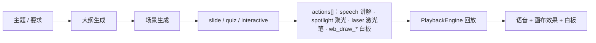
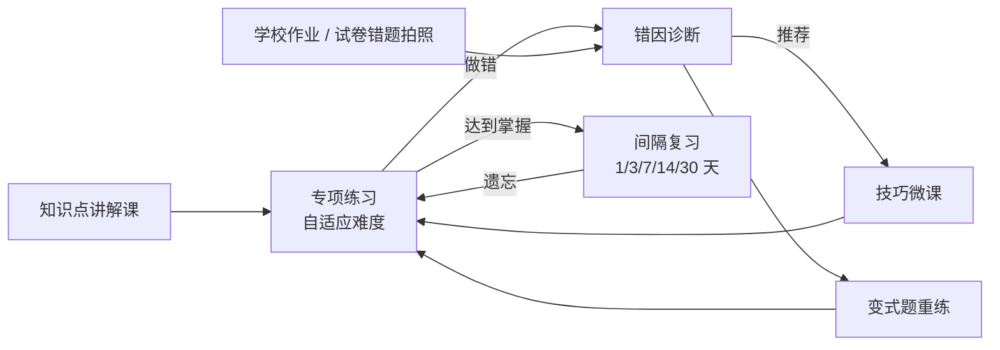
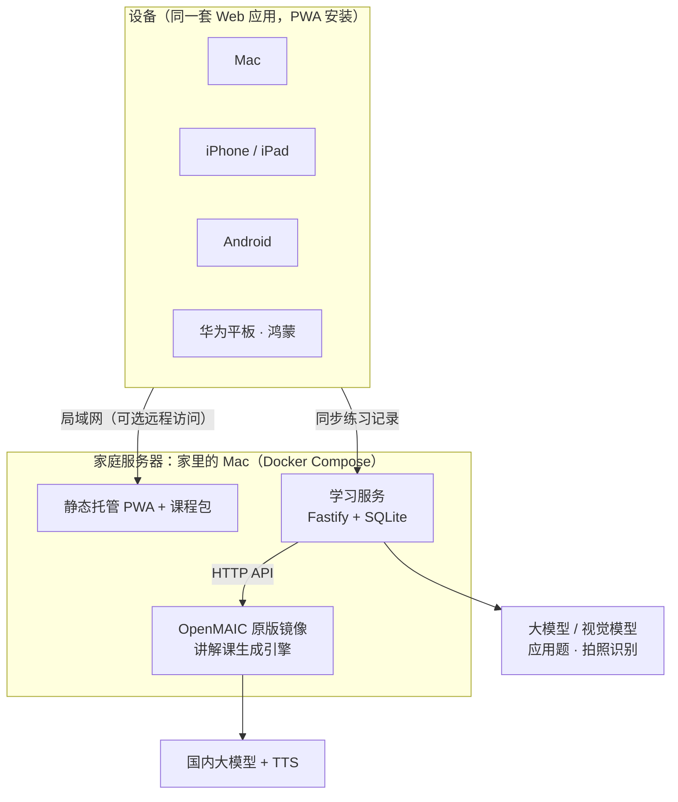

# 家庭小学数学 AI 学习 App：分析与技术方案

> 版本：v0.2（按家庭自用重写；v0.1 面向公开运营的版本见 git 历史）　日期：2026-09-24
> 参考项目：[THU-MAIC/OpenMAIC](https://github.com/THU-MAIC/OpenMAIC)（MIT 协议，分析基于 v1.1.0 / main 分支）
> 使用场景：家庭自用，给自家孩子补习和巩固
> 目标设备：Mac、iOS、Android、**华为平板（鸿蒙）**
> MVP 范围：**深圳北师大版数学，二年级和四年级**（当前学期先做上册）

---

## 0. 结论

1. **核心是专项练习，讲解课为练习服务。** 学习闭环是：知识点讲解 → 技巧讲解 → 专项练习（自适应难度）→ 错因诊断 → 针对性重练 → 间隔复习。
2. **计算类题目全部由程序生成**，答案 100% 正确，题量不限，难度可以精确控制（例如"只考退位减法""试商需要调商"）。分步解析也由程序给出，不依赖大模型。大模型只负责应用题出题和拍照识别错题，并且都要经过程序验算和家长审核。
3. **OpenMAIC 不 Fork，当作"讲解课生成引擎"使用。** 在家里部署原版 Docker 镜像，通过它的 `/api/generate-classroom` 接口生成讲解课和技巧课（含语音），再转换成我们自己的课程包。播放器从 OpenMAIC 移植过来。
4. **一套 Web 代码，以 PWA 形式覆盖全部设备**：Mac、iPhone/iPad、Android、华为平板（包括纯血鸿蒙）都用浏览器"添加到桌面"安装。不用上架应用商店，也不用处理 iOS 证书每 7 天过期的问题。只有在 PWA 不够用时，才按需加原生壳：鸿蒙用 ArkWeb 壳，Mac/Android 用 Tauri。
5. **家里的 Mac 当服务器**（Docker Compose：Web 应用 + 学习服务 + OpenMAIC）。孩子的设备离线优先，练习在本地运行，联网后同步记录。
6. **先交付练习，再做讲解课。** 大约 3 周可以让两个孩子用上专项练习（M0 + M1），之后再接入讲解课、AI 出题和拍照错题。

---

## 1. OpenMAIC 分析

### 1.1 项目概况

OpenMAIC（Open Multi-Agent Interactive Classroom）是清华 MAIC 团队开源的 AI 互动课堂平台。输入主题或文档，它会自动生成一堂课：幻灯片、测验、HTML 交互实验、项目式学习。上课时 AI 老师语音讲解，配合聚光灯、激光笔和白板推导，AI 同学可以参与讨论。

| 维度 | 情况 |
| --- | --- |
| 协议 | MIT（v0.3.0 起由 AGPL-3.0 改为 MIT），可以自由使用和修改，保留版权声明即可 |
| 技术栈 | Next.js 16 + React 19 + TypeScript + Tailwind CSS 4 + LangGraph + zustand + Dexie |
| 模型支持 | DeepSeek、通义千问、豆包、智谱 GLM、腾讯混元、Kimi、MiniMax 等国内模型都已内置适配 |
| 规模 | 应用层约 23.7 万行 TS/TSX；另有 6 个 `@openmaic/*` npm 包 |
| 形态 | 纯 Web，没有原生 App 壳 |

### 1.2 核心机制

一堂课是 **Stage（课）+ Scene[]（页）+ 每页的 Action[]（讲解动作序列）**：



这些都是结构化 JSON，可以离线生成、预先合成语音，再放到别的端上回放。本方案就是基于这一点设计的。

### 1.3 本项目怎么用 OpenMAIC

| OpenMAIC 能力 | 用法 | 说明 |
| --- | --- | --- |
| 服务端生成接口 `POST /api/generate-classroom` | **直接调用** | 传入 `requirement`（我们按知识点拼好的小学化要求）、`language: zh-CN`、`enableTTS: true`，然后轮询任务 |
| `GET /api/classroom?id=`、`/api/classroom-media/<id>/…` | **直接调用** | 取回 Stage + Scenes JSON 和语音、图片，转换成课程包 |
| `@openmaic/dsl`（npm） | 依赖 | 课件数据类型和校验 |
| `@openmaic/renderer`（npm） | 依赖 | React 幻灯片渲染 |
| 回放引擎 `lib/playback` + `lib/action`（约 1.6k 行） | **移植** | 不在 npm 包里，而且和 zustand 耦合，要抽成 `packages/player` |
| 白板、交互 iframe 渲染 | 移植 | 测验 UI 不用它的，用我们自己的练习系统 |
| 编辑器 / Web 界面 | 家长可选使用 | 家长可以直接在 OpenMAIC 界面里修改课件，再重新导入 |

**不 Fork 的好处**：OpenMAIC 迭代很快（SDK 还是 0.x），我们只通过 HTTP 接口和少量 npm 包使用它，锁定镜像版本即可，升级风险小。

### 1.4 OpenMAIC 缺什么（需要自己做）

- **练习系统**（最大的缺口）：它只有简单的单选、多选、简答测验，没有题目生成、自适应、错题本、掌握度、复习调度
- 教材知识点结构（北师大版 年级 → 册 → 单元 → 知识点）
- 孩子档案、学习记录、家长查看
- 适合孩子的界面和交互（大按钮、竖式输入、口诀挑战）
- 原生 App 壳（我们用 PWA 解决）

---

## 2. 使用场景与约束

- **家庭自用**：不对外提供服务，不涉及应用上架、教育 App 备案和"双减"合规。
- **家长把关**：教育部《中小学生成式人工智能使用指南（2025 年版）》建议小学生不要独自使用开放式 AI 生成功能。这对家庭同样是好习惯，所以默认 AI 内容先由家长预览，孩子端不开放自由对话（家长可以在设置里打开"陪同提问"）。
- **两个孩子**（按二年级和四年级理解，待确认）：各自一个档案，进度独立。**不做兄弟姐妹之间的排名比较。**
- **教材**：深圳小学数学用北师大版。二年级和四年级是否已经换成新修订版、单元顺序如何，**以孩子手上的课本目录为准**，M0 阶段请家长拍目录页后建知识点树。
- **时间**：现在是上学期（9 月），上册要在 1 月期末前用起来，下册在寒假前准备好。

---

## 3. 学习闭环



每个**知识点**是一个节点，挂着这些内容：

| 内容 | 形式 | 来源 |
| --- | --- | --- |
| 讲解课（8–12 分钟） | 幻灯片 + AI 老师语音 + 白板推导 + 例题 | OpenMAIC 生成，家长预览后发布 |
| 技巧微课（3–5 分钟） | 同上，只讲一个方法 | OpenMAIC 生成，关联到错因 |
| 专项练习 | 程序生成器 + 审核过的 AI 题库 | `packages/practice` |
| 错因标签 | 例如"忘记进位""试商偏大没调" | 诊断规则 |
| 前置知识点 | 例如"三位数乘两位数"依赖"乘法口诀"和"两位数乘两位数" | 知识点树 |

技巧微课举例：
- 二年级：进位加法凑十、退位减法破十、乘法口诀记忆规律（9 的口诀手指法）、画图理解乘除法、一步/两步应用题找数量关系
- 四年级：四舍五入试商、调商方法、凑整简便计算（25×4、125×8）、乘法分配律正用/逆用、大数改写与求近似数的区别、量角三步法、画线段图分析应用题

---

## 4. 专项练习系统设计（核心）

### 4.1 题目从哪里来

| 来源 | 适用 | 正确性保障 | 阶段 |
| --- | --- | --- | --- |
| **程序生成器** | 口算、竖式、口诀、单位换算、大数读写、简便计算、量角等计算和规则类题目 | 答案由代码计算，100% 正确；可复现（生成器 + 参数 + 随机种子） | M0–M1 |
| **AI 生成 + 程序验算 + 家长审核** | 应用题 / 解决问题 | 模型输出题目和结构化算式，程序验算答案，家长审核后才进题库 | M3 |
| **拍照错题** | 学校作业、试卷上做错的题 | 视觉模型识别题目 → 标注知识点和错因 → 生成同类变式题；家长确认识别结果 | M3 |
| **家长手动录入** | 任何题 | 家长自己把关 | M1 |

### 4.2 MVP 生成器清单（上册，以课本目录为准，M0 校准）

| 年级 | 领域 | 题型 | 可控难度 | 典型错因（诊断用） |
| --- | --- | --- | --- | --- |
| 二上 | 100 以内加减法 | 口算、竖式、连加连减、加减混合、带括号 | 是否进位/退位、项数、有无括号 | 忘记进位；退位后没减 1；数位没对齐 |
| 二上 | 表内乘法 | 口诀填空、看算式写积、看积找算式、限时挑战 | 口诀范围（2–5 / 6–9）、是否限时 | 相邻口诀混淆（如 6×8 和 7×8） |
| 二上 | 表内除法 | 平均分、用口诀求商 | 除数范围 | 想错口诀 |
| 二上 | 单位 | 人民币换算、长度单位选择与换算 | 单位组合 | 进率记错 |
| 四上 | 大数 | 读数写数、改写成"万/亿"作单位、四舍五入求近似数、比大小 | 位数、中间和末尾 0 的个数 | 中间的 0 读错；改写和求近似数混淆 |
| 四上 | 乘法 | 三位数×两位数竖式、因数末尾有 0、估算 | 进位次数、0 的位置 | 部分积没有错位；漏加进位；末尾 0 处理错 |
| 四上 | 除法 | 除数是两位数的除法（试商、调商）、商的变化规律 | 四舍/五入试商、是否需要调商、商中间或末尾有 0 | 试商偏大或偏小没调；余数 ≥ 除数；商写错位置 |
| 四上 | 运算律 | 简便计算、判断能否简便 | 凑整组合、分配律正用/逆用 | 分配律漏乘一项 |
| 四上 | 线与角 | 量角（交互量角器）、角的分类、用平角/周角求未知角 | 角度范围、开口方向 | 内圈外圈读反 |

应用题（二年级一步/两步、四年级乘除应用题）走"AI 生成 + 验算 + 审核"，放在 M3。

### 4.3 练习模式

| 模式 | 说明 |
| --- | --- |
| 知识点专项 | 选一个知识点，10–20 题，难度自适应 |
| 口算速练 | 限时挑战（如乘法口诀 1 分钟），记录速度曲线 |
| 竖式专练 | 逐格填写竖式（含进位、部分积、余数），可以开"逐步提示" |
| 错题重练 | 原题 + 同类变式题 |
| 到期复习 | 每个知识点 3–5 题的小测 |
| 单元小测 | 单元内混合出题，模拟测验，不给提示 |
| 纸质练习 | 生成 A4 PDF（竖式留足空间）+ 单独的答案页，适合练书写 |

### 4.4 作答交互（为孩子设计）

- **大号数字键盘**：不调系统键盘，按键大，平板和手机都好按。
- **竖式格子**：按数位对齐的格子，从右往左填，有进位小格。四年级的乘除竖式能定位到"哪一格错了"。
- **口诀挑战**：卡片翻转和连击，有节奏感。
- 选择、判断、比大小（点 `>` `<` `=`）、排序。
- **交互量角器**（SVG）：拖动、旋转量角器来读数。
- 答错时先给提示再给解析，不直接显示答案；解析由程序生成，逐步演示（例如竖式一步步动画）。

### 4.5 掌握度、自适应与复习

- **能力值**：孩子在每个知识点上有一个能力值 θ，每道题有难度 d（1–5）。每次作答后按 Elo 方式更新 θ。口算类把用时计入（超时算"半对"）。
- **选题**：选择预测正确率约 80% 的难度，让孩子"跳一跳够得着"。
- **掌握判定**：θ 达到该知识点的目标难度，并且最近 10 题正确率 ≥ 90%。口算类还要求速度达标，例如乘法口诀平均每题 ≤ 3 秒（阈值家长可调）。
- **间隔复习**：掌握后按 1、3、7、14、30 天安排复习。复习做错就退回"练习中"，间隔重置。
- **前置补救**：某个知识点反复卡住，而前置知识点的掌握度又低时，提示先回去练前置知识点。

### 4.6 错因诊断

计算题采用"典型错误库"的方法：把孩子的答案和一组"典型错误算法"的结果对比。例如"进位全部漏加""部分积没有错位""退位后没有减 1""试商偏大没有调"。命中就标注错因，然后：
1. 推荐对应的技巧微课；
2. 生成针对这个错因的专项题（例如全是"连续进位"的乘法）；
3. 计入家长报告里的"错因排行"。

竖式格子作答能精确到"哪一格、哪一步"出错，诊断更准。

### 4.7 错题本

- 做错自动收录，记录原题、孩子的答案、错因。
- **清除条件**：原题重做正确，并且在不同的日子做对 2 道同类变式题。
- 可以按知识点和错因筛选，也可以打印成纸质错题卷。

### 4.8 今日任务

每天自动生成，默认 15–20 分钟（家长可调），顺序是：
1. 口算热身（2 分钟）
2. 到期复习
3. 错题重练
4. 当前知识点专项练习
5. （可选）一节讲解课或技巧微课

完成后得星星、记连续打卡天数。激励只和孩子自己的过去比较。

### 4.9 家长模式（PIN 码进入）

- 每个孩子的知识点掌握地图（按单元，用颜色表示状态）
- 错因排行、正确率和用时趋势、每日学习时长
- 布置专项：选知识点、题量、截止日期
- 审核：AI 生成的应用题、讲解课（预览后才对孩子可见）
- 设置：每日时长上限、护眼提醒间隔、是否允许"陪同提问"、掌握阈值

---

## 5. 技术方案

### 5.1 总体架构



### 5.2 各设备怎么装

| 设备 | 默认方式 | 备选原生壳（M4，按需） |
| --- | --- | --- |
| Mac | Safari "添加到程序坞"或 Chrome 安装 PWA | Tauri 打包 .app（自用不需要公证） |
| iPhone / iPad | Safari "添加到主屏幕" | 用 Xcode 打包需要 Apple 开发者账号（¥688/年），免费账号安装的 App 每 7 天过期，**不推荐** |
| Android | Chrome/Edge 安装 PWA | Tauri 打包 APK 直接安装 |
| 华为平板（HarmonyOS 4.x 及以下） | 华为浏览器添加到桌面 | 同 Android APK |
| 华为平板（HarmonyOS 5 / NEXT） | 华为浏览器添加到桌面（鸿蒙浏览器基于 Chromium，支持 Service Worker） | **ArkWeb 壳**：ArkTS 写一个很薄的外壳，内嵌同一套 Web 包，用 DevEco Studio 调试签名装到自己的平板（需要免费的华为开发者账号，调试证书约 1 年续签一次） |

为什么 PWA 优先：一套代码全设备可用，不需要证书和上架，更新时刷新即可。M0 会在每台真机上验证三件事：① 离线缓存；② 音频连续播放（iOS 上用 Blob URL 播放缓存的音频，绕开 Service Worker 对 Range 请求的限制）；③ 添加到桌面后的全屏体验。哪台设备验证不过，就给那台单独做原生壳。所有平台相关的能力都走 `platform` 适配层，换壳不需要改业务代码。

### 5.3 客户端（apps/web）

- **技术**：Vite + React 19 + TypeScript + Tailwind CSS 4，和 OpenMAIC 同栈，可以直接用 `@openmaic/renderer`。
- **页面**：选孩子 → 首页（今日任务、继续学习）→ 知识地图 → 讲解/技巧课播放 → 专项练习 → 错题本 → 家长模式。
- **离线优先**：Service Worker 缓存应用本体；IndexedDB（Dexie）存练习记录、错题和课程包音频。题目生成器在本地运行，断网也能练。
- **同步**：作答记录是只追加的事件日志（每条带 UUID），联网后推送到服务器、拉取其他设备的记录，不会产生冲突。掌握度由事件日志确定性地重新计算，所以每台设备算出来一样。
- **适配**：手机竖屏时课件在上、作答区在下；平板和 Mac 横屏时左右分栏。竖式格子在平板上体验最好。

### 5.4 服务端（apps/server，跑在家里的 Mac）

- **技术**：Fastify + TypeScript + SQLite（家庭规模足够，备份就是复制一个文件）。
- **职责**：
  1. 同步孩子档案和练习事件日志
  2. 知识点树、题库（AI 题需要审核）、课程包目录
  3. **编排 OpenMAIC**：按知识点模板拼接生成要求 → 调用 `/api/generate-classroom` → 轮询 → 取回 JSON 和语音 → 转换成课程包 → 等待家长审核 → 发布
  4. 调用大模型出应用题（结构化输出 + 程序验算）；调用视觉模型识别拍照错题
- **API Key 只放在服务端**，客户端不接触。

生成讲解课的要求模板（示意）：

```
为深圳北师大版数学{年级}{册}「{单元}」中的知识点「{知识点}」生成一节 {8–12} 分钟的讲解课。
对象：{年级}小学生（约 {年龄} 岁）。语言口语化、句子短，术语与北师大版课本一致。
结构：生活情境导入（优先用深圳本地场景，如地铁、深圳湾公园、菜市场）→ 讲清概念和方法
→ 2 道例题在白板上逐步推导 → 3 道课堂小题 → 一句话小结。
每页文字不超过 40 字；不超出本册教学范围；不引入课本没有的解法名称。
```

### 5.5 数据模型（SQLite / IndexedDB 共用结构）

| 表 | 说明 |
| --- | --- |
| `children` | 孩子档案（昵称、头像、年级、教材版本） |
| `kp_nodes` | 知识点树（id 例：`bsd.g4a.u3.mul-3x2`）、前置关系、目标难度 |
| `lessons` / `lesson_packs` | 讲解课和技巧微课、课程包版本、审核状态 |
| `questions` | AI 题和手动录入题（生成器题不入库，只记录生成器 + 参数 + 种子） |
| `attempt_events` | 作答事件日志（孩子、题目、答案、对错、用时、错因、设备） |
| `mastery` / `reviews` | 掌握度和复习计划（可以从事件日志重新计算） |
| `mistakes` | 错题本 |
| `settings` / `usage_daily` | 家长设置、每日时长 |

### 5.6 课程包格式

```
bsd.g4a.u3.mul-3x2.lesson@v2/
├── manifest.json        # 知识点、时长、版本、审核时间、各文件哈希
├── stage.json           # @openmaic/dsl Stage
├── scenes/*.json        # Scene（slide/interactive）+ actions[]
├── audio/*.mp3          # 预合成讲解语音
└── images/*
```

### 5.7 模型与语音（按需二选一，都用国内服务）

| 用途 | 建议 |
| --- | --- |
| 讲解课生成 | DeepSeek / 通义千问 / 智谱 GLM（OpenMAIC 已内置） |
| 应用题出题 | 同上，结构化输出（题干 + 算式 + 答案），程序验算 |
| 拍照识别错题 | 通义千问 VL / 豆包视觉 / GLM 视觉模型 |
| 讲解语音 | OpenMAIC 已支持的国内 TTS（如 MiniMax），选一个亲切的"老师"音色 |

费用：练习部分不花模型费用。按国内主流模型价格估计，单节讲解课生成（含语音）约几毛到几块钱，一个学期两个年级的内容总费用预计在几百元以内，M2 实测后校准。

### 5.8 仓库结构（pnpm monorepo）

```
xuexi/
├── apps/
│   ├── web/             # 孩子端 + 家长模式（React PWA）
│   └── server/          # 同步、题库、课程包、编排 OpenMAIC 与大模型
├── packages/
│   ├── practice/        # 生成器、判分、分步解析、错因诊断、掌握度与复习调度（纯 TS，单元测试全覆盖）
│   ├── curriculum/      # 北师大版 二上/二下/四上/四下 知识点树（JSON）
│   ├── player/          # 讲解课播放引擎（移植自 OpenMAIC，保留 MIT 声明）
│   └── shared/          # 共享类型
├── shells/              # 可选原生壳（M4）：harmony/（ArkWeb）、tauri/
├── deploy/
│   └── docker-compose.yml   # web + server + openmaic（镜像锁定版本）
└── docs/
```

`packages/practice` 是核心，写成纯函数，不依赖 UI，便于测试：每个生成器都有"答案正确性"的属性测试（随机生成上千题，逐题用独立方法验算）。

---

## 6. 里程碑

| 阶段 | 预计 | 交付 | 孩子能用上什么 |
| --- | --- | --- | --- |
| **M0 骨架 + 第一批练习** | 约 1 周 | monorepo；PWA 骨架；6 个核心生成器（二上：进位/退位加减、乘法口诀；四上：三位数乘两位数、除数是两位数的除法、大数读写、简便计算）；大键盘和竖式格子输入；本地记录；Docker Compose 部署到家里 Mac；4 类设备真机验证；按课本目录建知识点树 | 口算、竖式、口诀练习 |
| **M1 专项练习闭环** | 约 2 周 | 上册全部生成器；掌握度 + 自适应 + 间隔复习；错因诊断；错题本；今日任务；两个孩子的档案；家长模式和报告；多设备同步；手动录题；打印 PDF | 完整的每日专项练习 |
| **M2 讲解课与技巧课** | 约 2 周 | 部署 OpenMAIC；服务端编排生成 → 课程包；移植播放器；家长预览、审核、重新生成；技巧微课和错因关联；离线缓存 | 知识点讲解和技巧微课 |
| **M3 AI 出题与拍照错题** | 约 2 周 | 应用题生成 + 验算 + 审核入库；拍照 → 识别 → 标注知识点和错因 → 生成变式题 | 应用题专项，学校错题变式练习 |
| **M4 原生壳与下册** | 按需 | 鸿蒙 ArkWeb 壳 / Tauri 壳（只给 PWA 验证不过的设备做）；二下、四下知识点和内容（寒假前完成） | 下学期内容 |

建议每个阶段结束后先让孩子试用一周，再根据反馈调整下一阶段的内容。

---

## 7. 风险与对策

| 风险 | 对策 |
| --- | --- |
| AI 讲解或题目出错 | 计算题全部由程序生成；AI 应用题必须经过程序验算和家长审核；讲解课家长预览后才对孩子可见 |
| 华为平板或 iOS 上 PWA 兼容性问题 | M0 真机验证；验证不过的设备单独做原生壳（鸿蒙用 ArkWeb 壳） |
| 家里的 Mac 不在线 | 客户端离线优先，练习在本地运行；讲解课提前下载；联网后补同步 |
| OpenMAIC 版本变化 | 只通过 HTTP 接口使用，锁定镜像版本；播放器移植一次后自己维护 |
| 孩子使用时间过长或依赖 AI | 家长设置每日时长和护眼提醒；默认不开放自由 AI 对话 |
| 数据和密钥安全 | 数据存放在家里；API Key 只在服务端；如需外网访问，用 Tailscale 等组网工具或 HTTPS + 登录保护 |

---

## 8. 待确认事项

1. **华为平板的系统版本**（设置 → 关于本机：HarmonyOS 4.x，还是 5.x / NEXT？）和型号。这决定它能不能装 APK。
2. **其他设备清单**：iPhone、iPad、安卓手机分别是哪些？孩子主要用哪台？
3. **家里的 Mac 能否常开当服务器**（Apple 芯片？能装 Docker Desktop 或 OrbStack 吗）？还是有 NAS 或云服务器？
4. **是否需要在外面访问**（例如家长在公司看报告）？还是只在家里局域网用？
5. **孩子情况**：是两个孩子分别读二年级和四年级吗？请拍一下两本数学课本的**目录页**，用来校准知识点树。
6. **大模型 API Key**：已有哪家（DeepSeek、通义、智谱、MiniMax 等）？M0 和 M1 不需要，M2 开始用。
7. 是否需要**纸质练习打印**？孩子是否允许在家长陪同下"问 AI 老师"？

---

## 参考资料

- OpenMAIC 仓库：<https://github.com/THU-MAIC/OpenMAIC>（SDK 用法见 `skills/openmaic/references/extend-sdk.md`，生成接口见 `generate-flow.md`）
- 《中小学生成式人工智能使用指南（2025 年版）》报道：<https://edu.cnr.cn/dj/20250513/t20250513_527167530.shtml>
- 深圳小学教材版本：<http://www.dzkbw.com/city/guangdong_shenzhenshi/xiaoxue.htm>
- 鸿蒙对 PWA 的支持：<https://bbs.itying.com/topic/67ffe64d687c4e0048a99db6>、<https://segmentfault.com/a/1190000046878865>
- 鸿蒙调试证书申请：<https://blog.csdn.net/HarmonyOS_002/article/details/140353493>
- Tauri 2：<https://v2.tauri.app/blog/tauri-20/>
