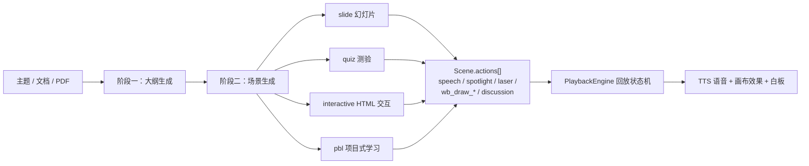
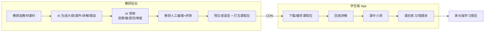
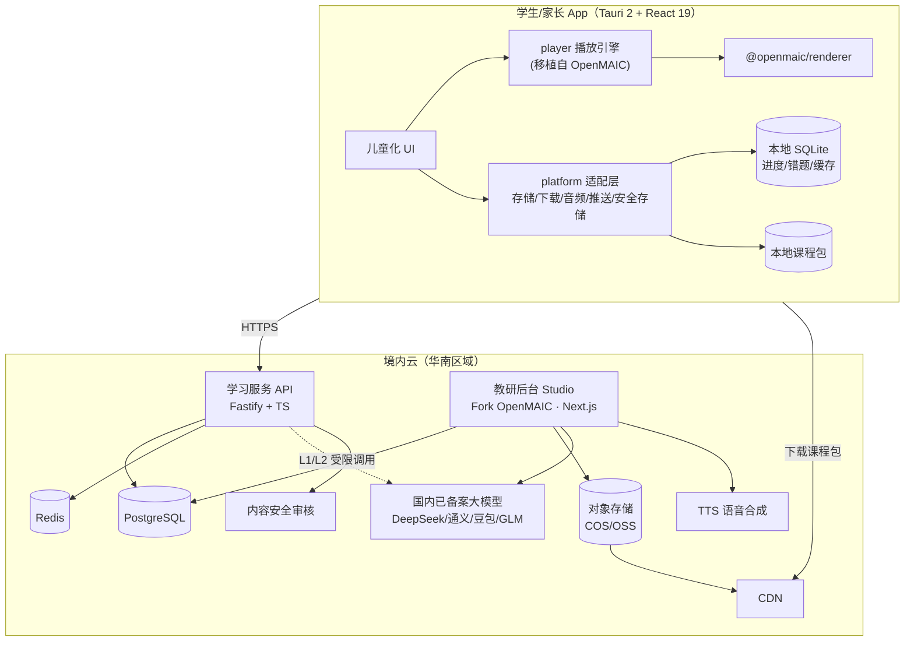

# 深圳小学 AI 互动课堂 App：分析与技术方案

> 版本：v0.1（草案，待确认）　日期：2026-09-24
> 参考项目：[THU-MAIC/OpenMAIC](https://github.com/THU-MAIC/OpenMAIC)（MIT 协议，分析基于 v1.1.0 / main 分支）
> 目标平台：macOS、iOS（含 iPad）、Android

---

## 0. 结论

1. **OpenMAIC 可以直接用，但不能原样给小学生用。** 它的生成流水线、幻灯片 DSL、渲染器和回放引擎可以复用（MIT 协议，可商用，需保留版权声明）。但它的形态是"学生输入任意主题，AI 实时生成、实时对话"，这和教育部《中小学生成式人工智能使用指南（2025 年版）》里"**小学阶段禁止学生独自使用开放式内容生成功能**"相冲突。
2. **核心设计原则：AI 备课、人工审核、学生回放。** 生成放在教研后台（改造 OpenMAIC），产出的课件经人工审核后打包成"课程包"发布。学生端只播放审核过的内容，语音提前合成好。这样合规，学生端不花大模型费用，也可以离线学习。
3. **课程内容按深圳教材版本同步**：语文统编版、数学北师大版（全市统一）、英语沪教牛津版（深圳用）。科学、道法等以学校实际使用的版本为准，按"教材版本 + 版次 + 年级 + 册 + 单元 + 课时"建模。
4. **客户端推荐用 Tauri 2 + React**：一套代码出 macOS / iOS / Android（Windows 也能顺带支持），可以直接复用 OpenMAIC 基于 React/DOM 的渲染器和 HTML 交互实验。备选是 Capacitor，平台能力统一封装在适配层里，换壳成本低。
5. **后端分三块**：教研后台（Fork OpenMAIC 的 Next.js）、学习服务 API（账号/进度/练习/错题）、对象存储 + CDN（课程包分发）。部署在境内，大模型只用已备案的国内模型。
6. **MVP 建议**：数学北师大版做一个年级的一册（约 40 课时），分 Phase 0（2 周 PoC + 合规确认）和 Phase 1（约 10 周）交付。

---

## 1. OpenMAIC 分析

### 1.1 项目是什么

OpenMAIC（Open Multi-Agent Interactive Classroom）是清华 MAIC 团队开源的 AI 互动课堂平台。输入一个主题或上传一份文档，它会自动生成一堂完整的课：幻灯片、测验、HTML 交互实验、项目式学习（PBL）。上课时 AI 老师语音讲解，配合聚光灯、激光笔和白板推导；AI 同学可以参与讨论。

### 1.2 技术栈与规模

| 维度 | 情况 |
| --- | --- |
| 协议 | MIT（v0.3.0 起由 AGPL-3.0 改为 MIT）→ 可 Fork、可商用，需保留 LICENSE 与版权声明 |
| 框架 | Next.js 16 + React 19 + TypeScript 5 + Tailwind CSS 4 |
| AI 编排 | LangGraph（多智能体导演图）、Vercel AI SDK；支持 DeepSeek / 通义千问 / 豆包 / 智谱 GLM / 腾讯混元 / Kimi / MiniMax 等国内模型 |
| 状态与存储 | zustand + Dexie(IndexedDB)；可选 PostgreSQL 服务端持久化 |
| 语音 | 多家 TTS / ASR 适配（含 MiniMax、Azure、VoxCPM2 自托管、FunASR 本地识别） |
| 规模 | 应用层（`app/` `components/` `lib/`）约 23.7 万行 TS/TSX |
| 形态 | **纯 Web**，没有任何原生 App 壳（没有 Capacitor/Tauri/Electron/RN） |

### 1.3 核心机制



关键点：**一堂课 = Stage（课）+ Scene[]（页/环节）+ 每个 Scene 上的 Action[]（讲解动作序列）**。数据都是结构化 JSON，所以可以预先生成、审核、打包，再放到另一个端上回放。这是本方案能成立的技术基础。

### 1.4 可复用资产

| 模块 | 位置 | 复用方式 | 说明 |
| --- | --- | --- | --- |
| `@openmaic/dsl` | npm / `packages/@openmaic/dsl` | **直接依赖** | 课件数据契约（Stage/Scene/Action/Slide 类型 + JSON Schema + 校验/迁移），零依赖 |
| `@openmaic/renderer` | npm | **直接依赖** | React 幻灯片渲染（`SlideCanvas`），需要 Tailwind 4 / motion；图表、代码高亮是可选依赖 |
| `@openmaic/generation` | npm | 教研后台使用 | 大纲 / 场景生成流水线与提示词，需针对小学改写提示词 |
| `@openmaic/importer` | npm | 教研后台使用 | 导入 PPTX / PDF（老师已有课件可以导入改造） |
| `@openmaic/editor` | npm | 教研后台使用 | 可编辑的幻灯片画布，供教研人工修改 |
| `@openmaic/storage` | npm | 参考 / 部分使用 | Document/Runtime/Asset/KV 存储抽象，有 Browser/HTTP/PG/S3 后端 |
| 回放引擎 | `lib/playback/*`、`lib/action/engine.ts`（约 1.6k 行） | **移植改造** | 不在 SDK 里，而且和 zustand store 耦合，需要抽成独立包 `packages/player` |
| 白板 / 测验 / 交互 iframe | `components/whiteboard`、`components/scene-renderers` | 移植 + 重做 UI | 测验 UI 要改成儿童化交互；交互实验沿用沙箱 iframe |
| 测验判分 | `app/api/quiz-grade` | 后端复用 | 主观题 AI 判分（受限使用，见 3.4） |
| 课堂导出 | `lib/export/*` | 参考 | 已支持离线 ZIP / HTML（资源内联），可以作为课程包格式的起点 |

注意：SDK 目前是 `0.x`，迭代很快，**必须锁定精确版本**，并定期跟进上游。

### 1.5 与本项目的差距

| 差距 | 说明 |
| --- | --- |
| 没有原生 App | 纯 Web，需要自建跨端壳 |
| 没有账号体系 | 只有站点级 ACCESS_CODE；官方文档说明服务端持久化模式"仅适用于 localhost 或可信网络下的单用户部署" |
| 没有教材 / 课标结构 | 课程是"任意主题"，没有年级→学科→教材版本→册→单元→课时的目录 |
| 没有审核流程 | 生成即可用，没有"草稿 → 审核 → 发布"流程和版本管理 |
| 没有学习闭环 | 没有进度跟踪、错题本、学习报告、家长 / 教师角色 |
| 面向成人 / 大学生 | 提示词、语言难度、交互方式不适合 6–12 岁儿童 |
| 实时开放生成 | 学生可以随意提问、随意生成，小学阶段不合规（见 2.1） |

---

## 2. 关键约束

### 2.1 政策约束（直接决定架构）

- **《中小学生成式人工智能使用指南（2025 年版）》**（教育部基础教育教学指导委员会，2025-05）："小学阶段禁止学生独自使用开放式内容生成功能，教师可在课内适当使用辅助教学。"
  → 学生端**不能**是"随便问 AI"。内容必须由教师 / 教研侧生成并把关，学生消费的是审核过的固定内容。
- **《生成式人工智能服务管理暂行办法》**：面向公众的生成式 AI 服务需要备案或登记，并防止未成年人过度依赖、沉迷。→ 只用已备案模型；如果学生端保留任何实时 AI 功能，需要完成应用登记，并做内容安全过滤。
- **《人工智能生成合成内容标识办法》**（2025-09-01 施行）→ AI 生成的课件、语音需要显式标识（例如课件角标"AI 辅助生成，教研审核"）。
- **"双减"政策**：面向义务教育学生的**学科类**线上培训受到严格监管。→ **运营主体和收费模式决定合规路径，必须最先确认**（见第 9 节）。
- **教育移动应用备案**（教育 App 备案管理系统）、**App ICP 备案**（上架国内安卓市场和 iOS 中国区都需要）。
- **《未成年人网络保护条例》《儿童个人信息网络保护规定》**：14 岁以下需要监护人单独同意、最小化收集信息、防沉迷和时长管理。
- **Apple 儿童类目**（如果上架 Kids 分类）：外链和购买需要"家长门禁"，禁止第三方广告和统计 SDK。

### 2.2 深圳小学教材版本

| 学科 | 版本 | 备注 |
| --- | --- | --- |
| 语文 | 统编版（人教社） | 课文和插图有版权，**不能直接搬运**，需要授权或只做原创讲解 |
| 数学 | 北师大版 | 深圳全市统一，最适合做 MVP |
| 英语 | 沪教牛津版（深圳用） | 需要跟读 / 口语评测能力 |
| 科学 | 各区不完全一致（部分区用教科版） | 上线前按区确认 |
| 道德与法治 | 统编版 | 后期考虑 |

另外，2024 年秋季起，按 2022 版新课标修订的新教材从起始年级开始逐年替换。所以课程目录必须带"版次"字段，同一年级可能同时存在新旧版本。

---

## 3. 产品方案

### 3.1 定位与原则

**定位**：与深圳教材同步的 AI 互动讲解课。每课时 8–15 分钟，由 AI 老师配合动画和白板讲解，课中穿插小测，课后配练习和错题本。

**原则**："AI 备课、人工审核、学生回放"。



### 3.2 用户角色

| 角色 | 端 | 主要诉求 |
| --- | --- | --- |
| 学生（1–6 年级） | App（手机 / 平板 / Mac） | 看懂、会做、有趣、不累眼 |
| 家长 | 同一个 App 里的"家长模式"（需家长验证才能进入） | 看进度和报告、管理时长、陪学 |
| 教研 / 教师 | Web 教研后台 | 高效产出准确、合规、对齐教材的课件 |
| 运营 / 管理员 | Web 管理后台 | 目录管理、发布、数据、账号 |

### 3.3 功能清单

| 模块 | MVP（Phase 1） | 后续 |
| --- | --- | --- |
| 课程目录 | 年级 → 学科 → 教材版本 → 册 → 单元 → 课时 | 按学校 / 区配置默认教材 |
| 课程播放器 | 幻灯片 + AI 老师语音 + 字幕 + 聚光灯 / 激光笔 + 白板推导；暂停、回看、倍速；"再讲一遍" | "换个例子"（预生成的备选讲解）；AI 同学脚本化讨论 |
| 课中小测 | 单选、多选、填空（自动判分 + 解析） | 拖拽、连线、口算限时等儿童化题型 |
| 交互实验 | 数学可操作模型（沙箱 iframe，断网运行） | 科学模拟实验 |
| 练习与错题 | 课后练习、错题本、错题重练 | 知识点薄弱分析、自适应推荐 |
| 离线 | 课程包下载、离线播放、进度离线记录后同步 | 整册一键下载、按存储空间自动清理 |
| 家长 | 绑定孩子、学习记录、每日时长上限、夜间禁用 | 周报推送、家长陪伴问答（受限 AI） |
| 健康 | 每 20 分钟护眼提醒、单次时长提醒 | 坐姿 / 距离提醒（摄像头，需谨慎评估隐私） |
| 英语 | — | 跟读、口语评测、单词卡 |
| 教研后台 | 按课时生成 → 编辑 → 审核 → 发布；题库；版本管理 | 批量生成、多人协同审核、质量看板 |

### 3.4 学生端 AI 能力分级

| 级别 | 能力 | 学生端是否实时调用大模型 | 默认 |
| --- | --- | --- | --- |
| L0 | 全部讲解和题目都是预生成 + 审核；"没听懂"按钮播放预生成的备选讲解 | 否 | ✅ 开启 |
| L1 | 主观题 / 填空变体判分：大模型按评分标准判分，只返回"对 / 错 + 审核过的解析模板" | 是（封闭任务） | 可选 |
| L2 | 家长陪伴问答：家长解锁后，只能围绕当前课程内容提问（基于课程内容检索，输入输出双向安全过滤，留日志） | 是（受限开放） | 默认关闭 |

L1 和 L2 需要完成生成式 AI 应用登记，并经法务确认后才能上线。

### 3.5 儿童化体验要点

- 大按钮、大字号（正文 ≥ 18pt），低年级页面配语音导航，少用文字菜单。
- 字幕与 AI 老师讲解同步（直接用 `speech.text`），方便听力较弱或安静环境下使用。
- 本地化情境：例题用深圳学生熟悉的场景（地铁线路、深圳湾公园、荔枝等），让孩子觉得"讲的就是我身边的事"。
- 手机竖屏：上方 16:9 课件、中间字幕、下方控制条；平板和 Mac 横屏：课件全屏 + 侧边栏。
- 正向激励：星星、连续打卡，但**不做排行榜或攀比机制**，也不做诱导沉迷的设计。

---

## 4. 技术方案

### 4.1 总体架构



### 4.2 客户端跨端选型

核心约束：OpenMAIC 的渲染器是 React + DOM + Tailwind，交互实验是任意 HTML/JS。**基于 WebView 的方案复用率最高。** Flutter 和 React Native 都得重写渲染器，交互实验照样离不开 WebView。

| 方案 | macOS | iOS | Android | 复用 OpenMAIC 渲染 | 优点 | 缺点 |
| --- | --- | --- | --- | --- | --- | --- |
| **Tauri 2 + React（推荐）** | ✅ 原生 | ✅ | ✅ | ✅ 直接用 | 一套工具链覆盖 3 端（+Windows）；包体小（几 MB）；Rust 端适合做大文件下载、解压、校验 | 移动端比桌面端新，插件生态较小；推送、微信等 SDK 需要自己写 Swift/Kotlin 插件 |
| Capacitor + React（备选） | ⚠️ 需要 Mac Catalyst 或另配 Electron | ✅ | ✅ | ✅ 直接用 | 移动端成熟，插件多，国内社区资料多 | macOS 要另想办法；桌面端和移动端两套工具链 |
| Flutter | ✅ | ✅ | ✅ | ❌ 需重写 | 原生性能好、UI 一致 | 渲染器、白板、测验全部重写；交互实验仍需 WebView |
| React Native / Expo | ⚠️ react-native-macos | ✅ | ✅ | ❌ 需重写 | 生态大 | macOS 支持弱；DOM 渲染器用不了 |

**决策**：选 Tauri 2。Phase 0 用两周做真机 PoC，重点验证：① iOS WKWebView 的音频自动连播；② 低端安卓 WebView 渲染性能；③ 大体积课程包的下载和离线加载；④ 麦克风权限（为英语跟读做准备）。如果 ①④ 在 Tauri 移动端遇到解决不了的问题，就改成"移动端 Capacitor + macOS Tauri"。前端代码和 `platform` 适配层是分开的，切换成本大约 1–2 周。

**鸿蒙提示**：纯血鸿蒙（HarmonyOS NEXT）不能运行安卓 APK，而深圳用户中华为设备比例不低。WebView 架构以后可以用 ArkWeb 壳复用同一套前端，列入 Phase 3。

### 4.3 客户端分层

```
apps/client
├── src/
│   ├── pages/            # 目录、课时详情、播放页、练习、错题本、家长模式
│   ├── features/         # 进度、下载管理、护眼/时长、家长门禁
│   └── platform/         # 平台实现（Tauri 版；未来 Capacitor / ArkWeb 版）
└── src-tauri/            # Rust：课程包下载/解压/sha256 校验、SQLite、安全存储
packages/player           # 回放引擎：从 OpenMAIC lib/playback + lib/action 移植，去 zustand 耦合
packages/platform         # 平台接口定义
```

平台接口示意（前端只依赖接口，不直接调用 Tauri API）：

```ts
export interface Platform {
  kv: { get(k: string): Promise<string | null>; set(k: string, v: string): Promise<void> };
  secureStore: { get(k: string): Promise<string | null>; set(k: string, v: string): Promise<void> };
  packs: {
    download(packId: string, url: string, sha256: string, onProgress: (ratio: number) => void): Promise<void>;
    resolveAsset(packId: string, path: string): string; // 返回 WebView 可加载的本地资源 URL
    list(): Promise<{ packId: string; version: number; bytes: number }[]>;
    remove(packId: string): Promise<void>;
  };
  audio: { play(src: string, rate?: number): Promise<void>; pause(): void; onEnded(cb: () => void): () => void };
  push?: { register(): Promise<string> }; // 安卓需接厂商通道（华为/小米/OPPO/vivo/荣耀），可用个推/极光
}
```

### 4.4 课程包格式

以 OpenMAIC 的课堂导出（资源内联、可离线）为基础，增加教材元数据、审核信息和签名：

```
math-bsd-g3a-u01-l02@v3.zip
├── manifest.json
├── stage.json               # @openmaic/dsl Stage
├── scenes/001.json …        # Scene（slide/quiz/interactive），含 actions[]
├── audio/<actionId>.mp3     # 预合成讲解语音
├── alt/<sceneId>.json       # "再讲一遍/换个例子"备选讲解
├── images/ …
└── interactive/<id>.html    # 资源全内联，CSP 禁止外网
```

```json
{
  "packId": "math-bsd-g3a-u01-l02",
  "version": 3,
  "dslVersion": "0.11.2",
  "curriculum": {
    "subject": "math", "edition": "北师大版", "revision": "2024",
    "grade": 3, "term": "上", "unit": 1, "lesson": 2
  },
  "durationSec": 720,
  "review": { "aiCheckedAt": "…", "reviewer": "T0012", "approvedAt": "…" },
  "aiGenerated": true,
  "files": { "stage.json": "sha256:…", "audio/a1.mp3": "sha256:…" }
}
```

- 客户端逐个校验文件哈希，防篡改；课程包由服务端签名。
- 版本号递增；以后可以做差分更新（只下载变化的文件）。

### 4.5 教研后台（Fork OpenMAIC）改造点

用 git subtree 引入 OpenMAIC 到 `apps/studio`，**新增代码尽量放在独立目录**，减少和上游的冲突：

1. **账号与权限**：替换 ACCESS_CODE，接入统一账号（教研 / 审核 / 管理员角色）。
2. **教材目录**：生成入口从"任意主题"改为"选择教材课时"，自动带入课标要求、教学目标、重难点、年级语言难度。
3. **小学化提示词**：分年级控制词汇和句长；限制每页字数和最小字号；数学例题用深圳本地情境；低年级语文课件可标注拼音。
4. **多智能体讨论脚本化**：在后台运行 OpenMAIC 的实时讨论，把结果录制成多角色 `speech` 动作序列，审核后作为固定内容回放（学生端能看到"AI 同学"，但不会实时生成）。
5. **AI 预审**：数学题答案用程序验算；事实类内容由第二个模型交叉校验；敏感词和内容安全检查；难度和时长检查。
6. **人工审核流程**：草稿 → AI 预审 → 教研编辑（`@openmaic/editor`）→ 终审 → 发布。每个状态都留痕，并记录审核人。
7. **发布器**：预合成 TTS（统一选一个儿童友好的"AI 老师"音色），打包、签名，上传对象存储，刷新 CDN。
8. **题库**：课后练习题独立管理，可以关联知识点。

### 4.6 学习服务 API 与数据模型

技术：Node.js（Fastify）+ TypeScript（与 `@openmaic/dsl` 共享类型）+ PostgreSQL + Redis。

核心表：

| 表 | 说明 |
| --- | --- |
| `users` / `guardianships` | 家长账号（手机号 + 验证码）；学生是家长名下的子账号，不需要手机号；家长与孩子的绑定关系 |
| `curricula` / `books` / `units` / `lessons` | 学科 × 教材版本 × 版次 → 年级 × 册 → 单元 → 课时 |
| `course_packs` | 课时的课程包版本、状态（draft / ai_checked / approved / published）、地址、哈希 |
| `questions` / `knowledge_points` | 题库与知识点 |
| `learning_records` | 课时进度、播放位置（对应 OpenMAIC 的 playback cursor）、完成情况 |
| `quiz_attempts` / `mistakes` | 作答记录、错题本 |
| `usage_daily` / `parental_settings` | 每日时长、家长设置的限制 |
| `consents` | 监护人同意记录（隐私政策版本、时间） |

登录：家长手机号验证码为主。如果接入微信登录，iOS 上必须同时提供"通过 Apple 登录"。

### 4.7 AI 与语音服务选型

| 能力 | 选型建议 | 使用位置 |
| --- | --- | --- |
| 课件生成大模型 | DeepSeek / 通义千问 / 豆包 / 智谱 GLM（均为已备案模型，OpenMAIC 已内置适配） | 教研后台 |
| 交叉校验模型 | 与生成模型不同厂商的另一个模型 | 教研后台 |
| TTS | 国内云厂商或 MiniMax，选儿童友好的教师音色；发布时预合成 | 教研后台 |
| 内容安全 | 云厂商内容安全服务（文本 / 图片） | 后台 + API |
| 英语口语评测 | 讯飞 / 腾讯等口语评测 SDK（Phase 2） | 客户端插件 |

成本特点：**学生端播放不调用大模型**，边际成本主要是 CDN 流量；大模型成本集中在课件生产环节，并且可以控制。

### 4.8 部署与运维

- 境内云，华南区域（广州 / 深圳）；完成 ICP 备案；如果面向学校或教育局，按等保 2.0 二级准备。
- 数据存放在境内；儿童个人信息加密存储，权限最小化。
- CI/CD：GitHub Actions。Android 在 Linux 构建；iOS 和 macOS 需要 macOS runner 构建和签名。
- 分发：iOS 和 macOS 走 App Store（macOS 也可以公证后发 DMG）；Android 上架应用宝、华为、小米、OPPO、vivo、荣耀等主流市场。

### 4.9 仓库结构（monorepo，pnpm workspace）

```
xuexi/
├── apps/
│   ├── client/          # 学生/家长 App：Vite + React 19 + Tauri 2
│   ├── studio/          # 教研后台：Fork OpenMAIC（git subtree），Next.js
│   └── api/             # 学习服务：Fastify + PostgreSQL
├── packages/
│   ├── course-schema/   # 课程包 manifest、教材目录 schema（基于 @openmaic/dsl）
│   ├── player/          # 回放引擎（移植自 OpenMAIC，MIT，保留版权声明）
│   ├── platform/        # 平台适配接口
│   └── ui/              # 儿童化组件库
├── docs/
└── THIRD_PARTY_NOTICES.md   # OpenMAIC 等 MIT 版权声明
```

---

## 5. 内容生产

### 5.1 单课时生产流程与分工

| 步骤 | 执行 | 产出 |
| --- | --- | --- |
| 1. 选课时并填写教学设计要点 | 教研 | 目标、重难点、易错点、本地情境建议 |
| 2. 生成大纲 | AI | 讲解结构（导入 → 新授 → 练习 → 小结） |
| 3. 教研调整大纲 | 教研 | 定稿大纲（OpenMAIC 已支持生成前编辑大纲） |
| 4. 生成课件和讲解动作 | AI | 幻灯片、白板推导、小测、备选讲解 |
| 5. AI 预审 | AI + 程序 | 验算报告、风险标注 |
| 6. 编辑和终审 | 教研 | 审核通过的课件 |
| 7. 合成语音并打包发布 | 系统 | 课程包 v1 |
| 8. 上线后收集反馈并迭代 | 教研 + 数据 | 课程包 v2 … |

### 5.2 审核清单（每课时）

- [ ] 知识点与教材版本、课标一致，没有超纲
- [ ] 数学计算和答案全部通过程序验算
- [ ] 语言符合该年级理解水平（术语与教材一致，例如北师大版的叫法）
- [ ] 没有复制教材原文或插图（语文另行授权）
- [ ] 没有敏感、不当或广告内容；图片没有版权问题
- [ ] 时长 8–15 分钟；每页字数和字号达标
- [ ] 带有 AI 生成标识

### 5.3 产能估算

以数学北师大版为例，每册约 40 课时，1–6 年级共 12 册，约 500 课时。按"AI 生成 + 人工审改"，每位熟练教研每天大约能完成 2–4 课时（需要在 Phase 1 实测校准）。所以 MVP 做一册，大约需要 2 名教研工作 2–4 周。

---

## 6. 里程碑

| 阶段 | 周期 | 交付 |
| --- | --- | --- |
| **Phase 0：PoC + 合规确认** | 2 周 | ① 确认运营主体和合规路径；② monorepo 骨架；③ 用 OpenMAIC 生成 1 节北师大数学课并导出课程包；④ Tauri 客户端在 Mac、iPhone/iPad、安卓（含一台低端机）上跑通播放（语音 + 白板 + 小测 + 离线）；⑤ 确定 Tauri 还是 Capacitor |
| **Phase 1：MVP** | 约 10 周 | 教研后台（目录、小学化生成、审核流程、发布）；学习 API（账号、目录、进度、错题）；客户端（目录、播放器、小测、练习、错题本、离线下载、家长模式基础版）；内容：数学北师大版一册（约 40 课时）；完成各类备案，准备上架 |
| **Phase 2：扩展** | 约 8 周 | 英语沪教牛津版（深圳用）+ 跟读和口语评测；学习周报与推送；"换个例子"备选讲解；自适应练习；L1 受限 AI 判分（经法务确认后） |
| **Phase 3：规模化** | 持续 | 更多年级和册；科学、语文（取得授权后）；学校 / 班级版（教师布置课时、班级数据）；鸿蒙 NEXT 壳；Windows 版 |

---

## 7. 团队与资源（MVP 参考）

| 角色 | 人数 | 说明 |
| --- | --- | --- |
| 客户端（React + Tauri） | 2 | 其中 1 人能写 Swift / Kotlin 插件 |
| 后端 | 1 | 学习 API、部署运维 |
| 全栈（Studio 改造） | 1 | 熟悉 Next.js 和 LLM 应用 |
| 数学教研 | 2 | 最好有深圳一线教学经验 |
| UI/UX | 1 | 儿童产品经验 |
| 测试 | 1 | 覆盖多机型真机 |
| 合规 / 运营 | 兼职 | 备案、隐私政策、上架 |

---

## 8. 风险与对策

| 风险 | 等级 | 对策 |
| --- | --- | --- |
| "双减"与运营主体合规 | 高 | Phase 0 先请法务确认；学校 / 教育局合作或公益模式与商业收费模式的路径完全不同 |
| 小学生使用生成式 AI 的限制 | 高 | 预生成 + 审核 + 回放架构；学生端默认 L0，不做实时开放生成 |
| 教材版权 | 高 | 原创讲解和例题，不复制课文和插图；语文等需要授权后再做 |
| AI 内容错误（幻觉） | 高 | 程序验算 + 交叉校验 + 人工终审，每节课可追溯审核人；上线后提供错误反馈入口 |
| Tauri 移动端成熟度 | 中 | Phase 0 真机 PoC；平台适配层隔离，可切换到 Capacitor |
| 低端安卓 WebView 性能 | 中 | 设定性能预算，动画可降级，课件分页懒加载 |
| OpenMAIC 迭代快（0.x） | 中 | 锁定精确版本；Fork 的改动尽量集中；定期合并上游 |
| 鸿蒙 NEXT 无法运行 APK | 中 | WebView 架构便于后续做 ArkWeb 壳 |
| 儿童隐私与数据安全 | 高 | 监护人同意、最小化收集、加密、境内存储、不接第三方广告和统计 SDK |

---

## 9. 待确认事项

1. **运营主体与模式**：学校 / 区教育局使用，公益免费，还是企业商业化收费？这决定合规路径，是第一优先级。
2. **使用场景**：以学生在家自学为主，还是也要支持课堂上教师投屏？这影响是否要做教师端和班级功能。
3. **MVP 范围**：是否同意先做"数学北师大版 · 某一年级一册"？具体做几年级？
4. **大模型与云厂商**：是否已有合作的模型和云厂商（例如腾讯云、阿里云、火山引擎）？
5. **内容团队**：是否有教研老师资源，还是需要外部合作？
6. **平台优先级**：Mac、iOS、安卓三端同时上线，还是先上一端？Windows 和鸿蒙是否需要？

---

## 参考资料

- OpenMAIC 仓库与中文 README：<https://github.com/THU-MAIC/OpenMAIC>
- OpenMAIC SDK 使用说明：仓库内 `skills/openmaic/references/extend-sdk.md`
- 教育部《中小学生成式人工智能使用指南（2025 年版）》报道：<https://edu.cnr.cn/dj/20250513/t20250513_527167530.shtml>、<https://www.gov.cn/lianbo/bumen/202505/content_7023810.htm>
- 教育移动应用备案政策解读（北京市教委）：<https://jw.beijing.gov.cn/xxgk/2024zcjd/202407/t20240709_3741681.html>
- 深圳小学教材版本：<http://www.dzkbw.com/city/guangdong_shenzhenshi/xiaoxue.htm>、<https://wiki.dushiquan.net/wd/20220531/4047.html>
- Tauri 2.0 稳定版发布说明：<https://v2.tauri.app/blog/tauri-20/>
